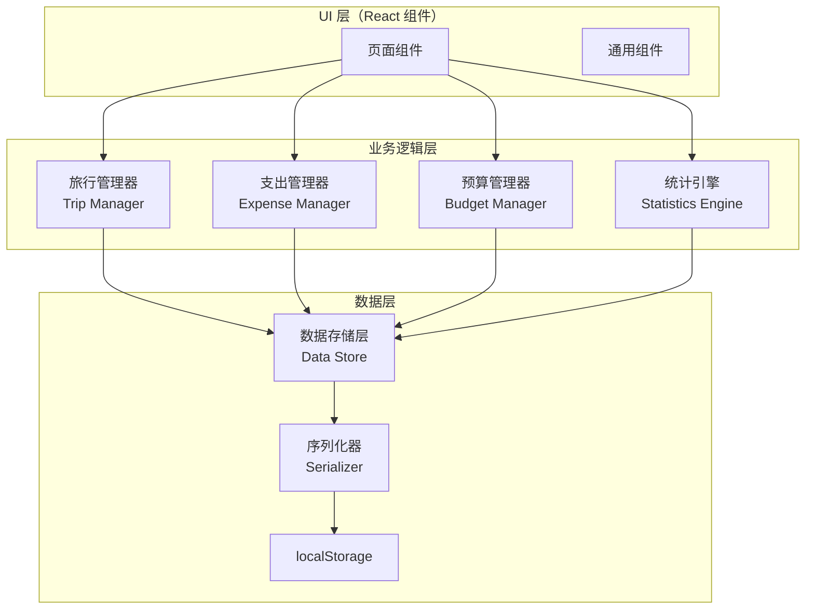
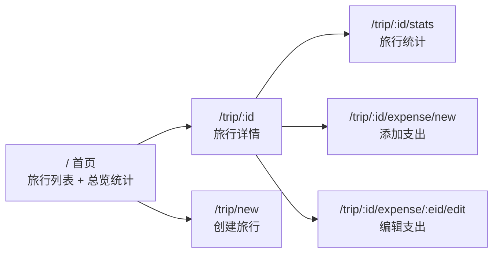
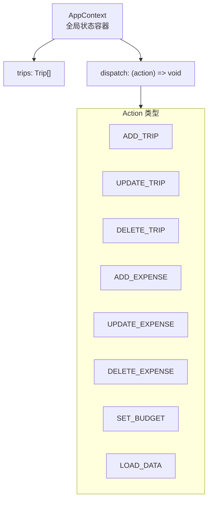

# 技术设计文档：旅游记账应用

## 概述

旅游记账应用是一个基于 React + TypeScript 的单页应用（SPA），用于帮助用户记录和管理旅行中的各项支出。应用采用纯前端架构，所有数据持久化在浏览器本地存储中（localStorage），无需后端服务。

核心功能包括：
- 旅行的创建与管理
- 支出记录的增删改查
- 按分类和日期的统计分析（饼图、折线图）
- 旅行预算设置与超支提醒
- 响应式布局，适配手机和桌面浏览器

技术选型：
- **前端框架**: React 18 + TypeScript
- **构建工具**: Vite
- **路由**: React Router v6
- **状态管理**: React Context + useReducer
- **图表库**: Recharts（轻量级 React 图表库）
- **样式方案**: CSS Modules
- **数据存储**: localStorage（JSON 序列化）
- **测试框架**: Vitest + fast-check（属性测试）

## 架构

应用采用分层架构，将 UI 展示、业务逻辑和数据存储清晰分离。



### 页面路由结构



### 状态管理

使用 React Context + useReducer 管理全局状态，避免引入额外的状态管理库。



## 组件与接口

### 业务逻辑模块

#### TripManager（旅行管理器）

```typescript
// 创建旅行
function createTrip(input: CreateTripInput): Result<Trip, ValidationError>;

// 获取所有旅行列表（支持排序）
function getTrips(sortBy: TripSortField, order: SortOrder): Trip[];

// 获取单个旅行详情（含支出列表）
function getTripDetail(tripId: string): Trip | null;

// 计算旅行总支出
function calculateTripTotal(expenses: Expense[]): number;
```

#### ExpenseManager（支出管理器）

```typescript
// 添加支出记录
function addExpense(tripId: string, input: CreateExpenseInput): Result<Expense, ValidationError>;

// 编辑支出记录
function updateExpense(expenseId: string, input: UpdateExpenseInput): Result<Expense, ValidationError>;

// 删除支出记录
function deleteExpense(tripId: string, expenseId: string): void;

// 验证支出输入
function validateExpenseInput(input: CreateExpenseInput): ValidationError[];
```

#### StatisticsEngine（统计引擎）

```typescript
// 按分类汇总支出
function getCategoryBreakdown(expenses: Expense[]): CategorySummary[];

// 按日期汇总每日支出
function getDailyTrend(expenses: Expense[], startDate: string, endDate: string): DailyExpense[];

// 获取所有旅行的总览统计
function getOverallStats(trips: Trip[]): OverallStats;
```

#### BudgetManager（预算管理器）

```typescript
// 设置/更新旅行预算
function setBudget(tripId: string, amount: number): Result<Budget, ValidationError>;

// 获取预算使用情况
function getBudgetStatus(budget: Budget, totalExpense: number): BudgetStatus;

// 检查是否需要超支提醒
function checkBudgetAlert(budget: Budget, currentTotal: number, newExpenseAmount: number): BudgetAlert | null;
```

#### DataStore（数据存储层）

```typescript
// 保存所有数据到本地存储
function saveData(data: AppData): void;

// 从本地存储加载数据
function loadData(): Result<AppData, DataError>;

// 序列化应用数据为 JSON 字符串
function serialize(data: AppData): string;

// 反序列化 JSON 字符串为应用数据
function deserialize(json: string): Result<AppData, DataError>;
```

### React 组件

#### 页面组件

| 组件 | 路由 | 职责 |
|------|------|------|
| `TripListPage` | `/` | 旅行列表 + 总览统计 |
| `CreateTripPage` | `/trip/new` | 创建旅行表单 |
| `TripDetailPage` | `/trip/:id` | 旅行详情 + 支出列表 + 预算状态 |
| `TripStatsPage` | `/trip/:id/stats` | 分类饼图 + 每日趋势图 |
| `AddExpensePage` | `/trip/:id/expense/new` | 添加支出表单 |
| `EditExpensePage` | `/trip/:id/expense/:eid/edit` | 编辑支出表单 |

#### 通用组件

| 组件 | 职责 |
|------|------|
| `ExpenseForm` | 支出表单（添加/编辑复用） |
| `TripForm` | 旅行表单（创建时使用） |
| `BudgetBar` | 预算进度条 |
| `BudgetAlert` | 预算警告提示 |
| `ConfirmDialog` | 确认对话框 |
| `EmptyState` | 空状态提示 |
| `CategoryPieChart` | 分类饼图 |
| `DailyTrendChart` | 每日趋势图 |

## 数据模型

### 核心类型定义

```typescript
// 支出分类枚举
type ExpenseCategory = '交通' | '住宿' | '餐饮' | '门票' | '购物' | '其他';

// 旅行记录
interface Trip {
  id: string;           // 唯一标识符（UUID）
  name: string;         // 旅行名称
  destination: string;  // 目的地
  startDate: string;    // 起始日期（ISO 格式 YYYY-MM-DD）
  endDate: string;      // 结束日期（ISO 格式 YYYY-MM-DD）
  budget?: number;      // 可选预算金额
  expenses: Expense[];  // 该旅行下的所有支出记录
  createdAt: string;    // 创建时间（ISO 格式）
}

// 支出记录
interface Expense {
  id: string;                  // 唯一标识符（UUID）
  tripId: string;              // 关联的旅行 ID
  amount: number;              // 金额（正数）
  category: ExpenseCategory;   // 支出分类
  note: string;                // 备注
  date: string;                // 支出日期（ISO 格式 YYYY-MM-DD）
  createdAt: string;           // 创建时间（ISO 格式）
}

// 预算状态
interface BudgetStatus {
  budgetAmount: number;    // 预算总额
  spentAmount: number;     // 已花费金额
  remainingAmount: number; // 剩余金额
  usagePercent: number;    // 使用百分比（0-100+）
  level: 'normal' | 'warning' | 'exceeded'; // 状态级别
}

// 分类汇总
interface CategorySummary {
  category: ExpenseCategory;
  totalAmount: number;
  percentage: number;  // 占比百分比（0-100）
}

// 每日支出
interface DailyExpense {
  date: string;       // 日期（YYYY-MM-DD）
  totalAmount: number; // 当日总支出
}

// 总览统计
interface OverallStats {
  totalTrips: number;
  totalExpense: number;
  tripExpenses: Array<{ tripId: string; tripName: string; totalExpense: number }>;
}

// 应用全局数据
interface AppData {
  trips: Trip[];
  version: number;  // 数据版本号，用于未来数据迁移
}

// 表单输入类型
interface CreateTripInput {
  name: string;
  destination: string;
  startDate: string;
  endDate: string;
  budget?: number;
}

interface CreateExpenseInput {
  amount: number;
  category: ExpenseCategory;
  note: string;
  date: string;
}

interface UpdateExpenseInput extends CreateExpenseInput {}

// 排序相关
type TripSortField = 'startDate' | 'name' | 'totalExpense';
type SortOrder = 'asc' | 'desc';

// 结果类型
type Result<T, E> = { ok: true; value: T } | { ok: false; error: E };

// 错误类型
interface ValidationError {
  field: string;
  message: string;
}

interface DataError {
  type: 'parse_error' | 'corrupted_data';
  message: string;
}

// 预算提醒
interface BudgetAlert {
  type: 'warning_80' | 'will_exceed' | 'exceeded';
  message: string;
  overAmount?: number;  // 超出金额
}
```

### 数据存储格式

数据以 JSON 格式存储在 localStorage 中，key 为 `travel-expense-tracker-data`：

```json
{
  "version": 1,
  "trips": [
    {
      "id": "uuid-1",
      "name": "东京之旅",
      "destination": "东京",
      "startDate": "2024-03-01",
      "endDate": "2024-03-07",
      "budget": 15000,
      "expenses": [
        {
          "id": "uuid-2",
          "tripId": "uuid-1",
          "amount": 3500,
          "category": "交通",
          "note": "机票",
          "date": "2024-03-01",
          "createdAt": "2024-03-01T10:00:00Z"
        }
      ],
      "createdAt": "2024-02-28T10:00:00Z"
    }
  ]
}
```

## 正确性属性

*属性是指在系统所有合法执行中都应成立的特征或行为——本质上是对系统应做什么的形式化陈述。属性是人类可读规格说明与机器可验证正确性保证之间的桥梁。*

以下属性基于需求文档中的验收标准推导而来，每个属性都包含明确的"对于任意"全称量化语句，可直接用于属性测试。

### 属性 1：创建旅行保留所有字段

*对于任意*合法的旅行输入（非空名称、结束日期不早于起始日期），调用 createTrip 后返回的旅行记录应包含与输入一致的名称、目的地、起始日期和结束日期。

**验证需求：1.1**

### 属性 2：空名称旅行被拒绝

*对于任意*纯空白字符组成的字符串（包括空字符串），以该字符串作为旅行名称调用 createTrip 应返回验证错误，且不创建任何旅行记录。

**验证需求：1.2**

### 属性 3：非法日期范围被拒绝

*对于任意*两个日期，当结束日期严格早于起始日期时，调用 createTrip 应返回验证错误，且不创建任何旅行记录。

**验证需求：1.3**

### 属性 4：旅行 ID 唯一性

*对于任意* N 次连续创建旅行操作（N ≥ 2），所有生成的旅行 ID 应互不相同。

**验证需求：1.4**

### 属性 5：旅行列表排序正确性

*对于任意*一组旅行记录和任意排序字段（startDate / name / totalExpense）及排序方向（asc / desc），调用 getTrips 返回的列表应满足：列表中每对相邻元素在指定字段上的顺序符合指定方向。

**验证需求：2.2, 2.3**

### 属性 6：旅行总支出等于支出金额之和

*对于任意*一组支出记录，calculateTripTotal 的返回值应等于该组支出中所有 amount 字段的算术和。

**验证需求：3.2, 5.3, 6.2**

### 属性 7：支出记录按日期降序排列

*对于任意*一组支出记录，在旅行详情中获取的支出列表应按 date 字段降序排列，即列表中每对相邻元素满足前者日期 ≥ 后者日期。

**验证需求：3.3**

### 属性 8：创建支出保留所有字段

*对于任意*合法的支出输入（正数金额、合法分类、合法日期），调用 addExpense 后返回的支出记录应包含与输入一致的金额、分类、备注和日期，且 tripId 等于指定的旅行 ID。

**验证需求：4.1**

### 属性 9：非正数金额被拒绝

*对于任意*小于等于零的数值，以该数值作为支出金额调用 addExpense 应返回验证错误，且不创建任何支出记录。

**验证需求：4.3**

### 属性 10：更新支出反映新值

*对于任意*已存在的支出记录和任意合法的更新输入，调用 updateExpense 后该支出记录的金额、分类、备注和日期应等于更新输入中的对应值。

**验证需求：5.2**

### 属性 11：删除支出后记录消失

*对于任意*旅行及其中的任意支出记录，调用 deleteExpense 后，该旅行的支出列表中不应再包含该支出的 ID。

**验证需求：6.2**

### 属性 12：分类汇总不变量

*对于任意*一组支出记录，调用 getCategoryBreakdown 返回的结果应满足：(a) 所有分类的 totalAmount 之和等于支出总额；(b) 所有分类的 percentage 之和等于 100%（允许浮点误差 ±0.01）；(c) 结果中不包含 totalAmount 为零的分类。

**验证需求：7.1, 7.3, 7.4**

### 属性 13：每日汇总不变量

*对于任意*一组支出记录和旅行的起止日期，调用 getDailyTrend 返回的结果应满足：(a) 所有日期的 totalAmount 之和等于支出总额；(b) 返回的日期列表覆盖从起始日期到结束日期的每一天（天数 = endDate - startDate + 1）；(c) 没有支出的日期其 totalAmount 为零。

**验证需求：8.1, 8.3, 8.4**

### 属性 14：总览统计正确性

*对于任意*一组旅行记录，调用 getOverallStats 返回的结果应满足：(a) totalTrips 等于旅行数组长度；(b) totalExpense 等于所有旅行总支出之和；(c) tripExpenses 列表按 totalExpense 降序排列。

**验证需求：9.1, 9.2, 9.3**

### 属性 15：序列化往返一致性

*对于任意*合法的 AppData 对象，执行 deserialize(serialize(data)) 应产生与原始 data 深度相等的对象。

**验证需求：10.1, 10.2, 11.1, 11.2, 11.3**

### 属性 16：损坏数据优雅处理

*对于任意*非法 JSON 字符串或结构不符合 AppData 格式的 JSON 字符串，调用 deserialize 应返回 DataError 而非抛出异常。

**验证需求：10.3**

### 属性 17：非正数预算被拒绝

*对于任意*小于等于零的数值，以该数值作为预算金额调用 setBudget 应返回验证错误，且不修改旅行的预算数据。

**验证需求：12.3**

### 属性 18：预算设置持久化

*对于任意*旅行和任意正数预算金额，调用 setBudget 后该旅行记录的 budget 字段应等于设置的金额。

**验证需求：12.4, 12.5**

### 属性 19：预算状态计算正确性

*对于任意*正数预算金额和任意非负支出总额，调用 getBudgetStatus 返回的结果应满足：(a) remainingAmount = budgetAmount - spentAmount；(b) usagePercent = spentAmount / budgetAmount × 100；(c) 当 usagePercent < 80 时 level 为 'normal'，当 80 ≤ usagePercent ≤ 100 时 level 为 'warning'，当 usagePercent > 100 时 level 为 'exceeded'。

**验证需求：13.1, 13.2, 14.1, 14.2**

### 属性 20：新增支出超支预检查

*对于任意*已设置预算的旅行、当前支出总额和新增支出金额，当 currentTotal + newAmount > budget 时，调用 checkBudgetAlert 应返回非空的 BudgetAlert；当 currentTotal + newAmount ≤ budget 且 currentTotal < budget × 0.8 时，应返回 null。

**验证需求：14.3**

## 错误处理

### 输入验证错误

| 场景 | 处理方式 |
|------|----------|
| 旅行名称为空或纯空白 | 返回 ValidationError，字段提示"请输入旅行名称" |
| 结束日期早于起始日期 | 返回 ValidationError，字段提示"结束日期不能早于起始日期" |
| 支出金额为空 | 返回 ValidationError，字段提示"请输入支出金额" |
| 支出金额为非正数 | 返回 ValidationError，字段提示"金额必须大于零" |
| 预算金额为非正数 | 返回 ValidationError，字段提示"预算金额必须大于零" |

### 数据存储错误

| 场景 | 处理方式 |
|------|----------|
| localStorage 数据损坏 | deserialize 返回 DataError，应用初始化为空数据状态，显示提示 |
| localStorage 不可用（隐私模式等） | 捕获异常，显示"数据无法保存"的提示，应用仍可正常使用但数据不持久化 |
| JSON 解析失败 | deserialize 返回 DataError，类型为 parse_error |
| 数据结构不符合预期 | deserialize 返回 DataError，类型为 corrupted_data |

### 业务逻辑错误

| 场景 | 处理方式 |
|------|----------|
| 查询不存在的旅行 ID | getTripDetail 返回 null，UI 显示"旅行不存在"并引导返回列表 |
| 删除不存在的支出 | 静默忽略，不影响现有数据 |
| 预算超支 | 显示警告但不阻止操作，用户确认后可继续 |

## 测试策略

### 测试框架

- **单元测试**: Vitest
- **属性测试**: fast-check（基于 Vitest 运行）
- **组件测试**: React Testing Library + Vitest

### 属性测试配置

- 使用 `fast-check` 库进行属性测试
- 每个属性测试至少运行 100 次迭代
- 每个属性测试必须通过注释引用设计文档中的属性编号
- 标签格式：**Feature: travel-expense-tracker, Property {编号}: {属性描述}**
- 每个正确性属性由一个属性测试实现

### 单元测试覆盖

单元测试聚焦于具体示例和边界情况：

- **输入验证**: 测试各种边界输入（空字符串、零、负数、极大数值）
- **默认值行为**: 未选择分类时默认为"其他"（需求 4.5）
- **空状态**: 无旅行时的列表展示（需求 2.4）
- **删除确认**: 取消删除不修改数据（需求 6.3）
- **分类枚举**: 验证支持的分类列表完整性（需求 4.4）

### 属性测试覆盖

属性测试覆盖所有 20 个正确性属性，重点模块：

- **TripManager**: 属性 1-5（创建、验证、排序）
- **ExpenseManager**: 属性 6-11（CRUD、计算、排序）
- **StatisticsEngine**: 属性 12-14（分类汇总、每日趋势、总览统计）
- **DataStore/Serializer**: 属性 15-16（序列化往返、损坏数据处理）
- **BudgetManager**: 属性 17-20（验证、设置、状态计算、超支预检查）

### 测试数据生成策略（fast-check Arbitraries）

```typescript
// 生成合法的支出分类
const categoryArb = fc.constantFrom('交通', '住宿', '餐饮', '门票', '购物', '其他');

// 生成合法的日期字符串（YYYY-MM-DD）
const dateArb = fc.date({ min: new Date('2020-01-01'), max: new Date('2030-12-31') })
  .map(d => d.toISOString().split('T')[0]);

// 生成合法的金额（正数）
const amountArb = fc.float({ min: 0.01, max: 1000000, noNaN: true });

// 生成非正数金额
const nonPositiveAmountArb = fc.oneof(
  fc.constant(0),
  fc.float({ max: -0.01, noNaN: true })
);

// 生成合法的旅行输入
const tripInputArb = fc.record({
  name: fc.string({ minLength: 1 }).filter(s => s.trim().length > 0),
  destination: fc.string(),
  startDate: dateArb,
  endDate: dateArb,
}).filter(t => t.endDate >= t.startDate);

// 生成合法的支出输入
const expenseInputArb = fc.record({
  amount: amountArb,
  category: categoryArb,
  note: fc.string(),
  date: dateArb,
});
```
